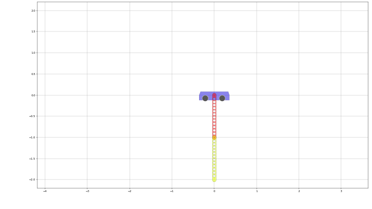

# Draft implementation of the collocation algorithm

There are three algorithms implemented:
1. `bvp_solver.solve_bvp` finds solution to the boundary value problem of the form
$$
    \dot{x} = f(x), \\
    g(x(0), x(T)) = 0.
$$
1. `bvp_solver.solve_control` finds solution the a point-to-point control problem
$$
    \dot{x} = f(x, u), \\
    \alpha(x(0)) = 0, \\
    \beta(x(T)) = 0, \\
    u \geq u_{\min}, \\
    u \leq u_{\max}. \\
$$
3. `bvp_solver.solve_mechanical_bvp` finds solution the a point-to-point control 
   problem for the special case when plant is a mechanical system of the form 

$$
    M(q)\ddot q + C(q,\dot q)\dot q + G(q) = B(q)u
$$

## Example: cart-pendulum swing-up
The demonstrating example is found in `cartpend_solver.py`. The script uses `solve_mechanical_bvp` to find a solution to the following motion planning problem:
$$
    M(q) \ddot q + C(q,\dot q) \dot q + G(q) = B(q) u, \\
    u_{\min} \leq u \leq u_{\max}, \\
    q\left(0\right)	= \left[0;\pi\right], \\
    q\left(T\right)	= \left[0;0\right], \\
    \dot{q}\left(0\right) = 0, \\
    \dot{q}\left(T\right) = 0
$$

